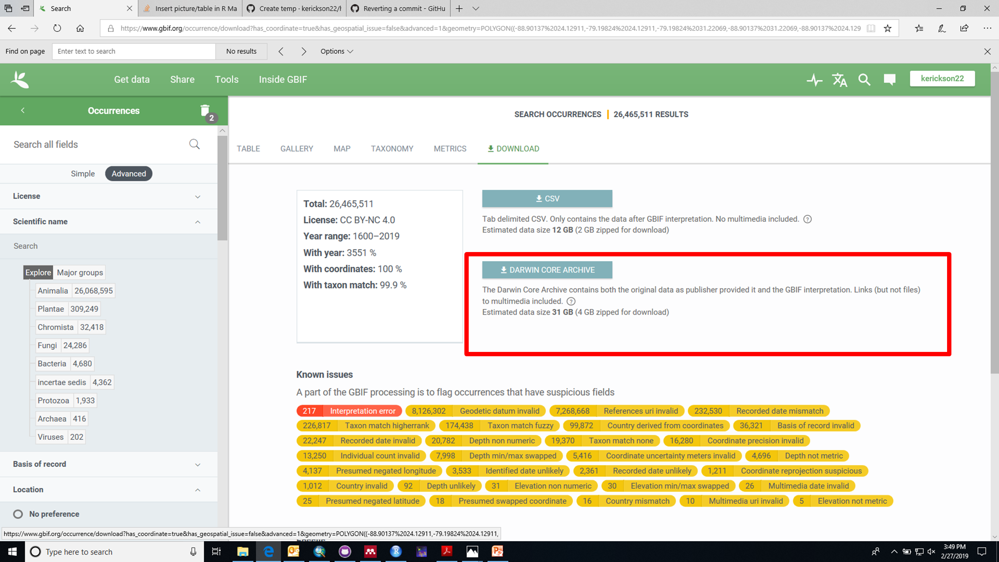
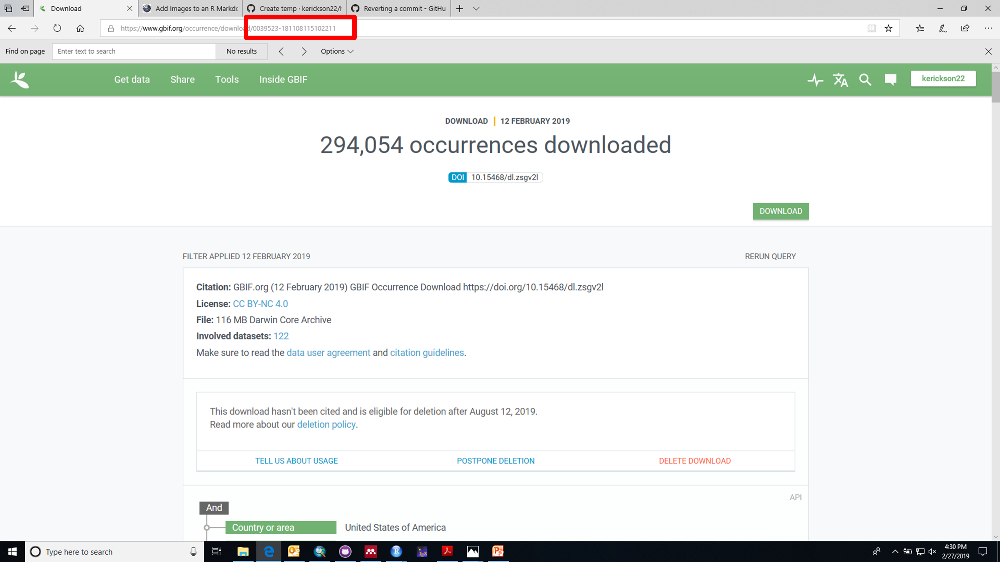

```{r setup, include=FALSE}
knitr::opts_chunk$set(echo = TRUE)

library(rgbif)

```
There are several different ways to use the package `rgbif` to download data into R. The following are instructions for using one of those methods. This method assumes that you have used the GBIF website to find the occurrences you want to download. 


## Step 1: Select Darwin Core download
Click the button to download the Darwin Core version.  



## Step 2: Locate the download key number: 
Copy this number. Each download page will have its own unique dowload key number. 



## Step 3: Set the download key 
Copy and paste the download key number into the key field of the `occ_download_get` function. Running this function will also store a zip file of the data into your working directory. 

```{r, set download key}


res2 <- occ_download_get(key="0039523-181108115102211")

```


## Step 4: Import the data into R and save it

Use the `occ_download_import` function to read the downloaded data into R. 

```{r, importing records}
tracheophytes_nocoords <- occ_download_import(res2, fill=FALSE, quote="")

dim(tracheophytes_nocoords)


save(tracheophytes_nocoords, file="00Tracheophyte records from download.RData")
```

Something is still not correct, as the number of records (294,052) does not match the number of records claimed to be available on the GBIF download page(294,054). (In this example it's only a matter of two records, but for other downloads, the two can differ by about a hundred records or so) BUT regardless of whether I open the data in PilotEdit, Excel, or importing it through rgbif, I get the same number of observations.

Using the package RGBIF solved several issues that PilotEdit/Excel could not easily solve: Extraneous "" floating around, and a misalignment of columns when the data was opened in PilotEdit/read as a csv into R.
